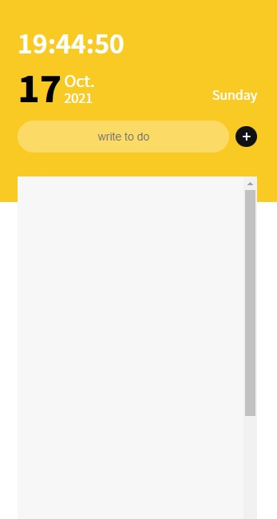
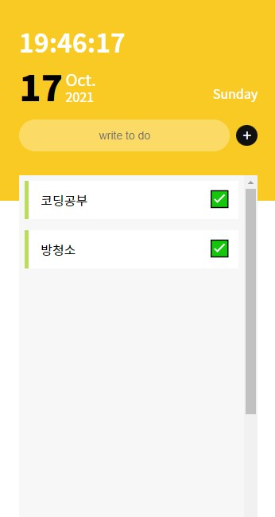

# 💻[토이프로젝트]VanillaJS_ToDoList
    바닐라자바스크립트로 프로젝트를 진행하면서 다양한 메서드들을 익히고 함수 작동 방식을 익히는 것을 목표로 했다.

  

## ⚙구현 목표
* 현재 시간 구현 
* 오늘 날짜 구현 
* todolist 입력 
* todolist 삭제 
* localstorage 연동

  

## ✅구현 방법

  

## ✨최종 구현 결과
   

[결과물 보러가기](https://ahn-sujin.github.io/VanillaJS_ToDoList/html/index.html)

  

### 참고
https://m.blog.naver.com/expensive07/222041037639

노마드코더 - 크롬 앱 만들기 

#### Contact 
:envelope: asj9674@gmail.com
